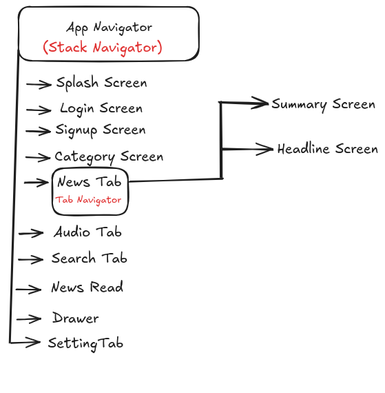
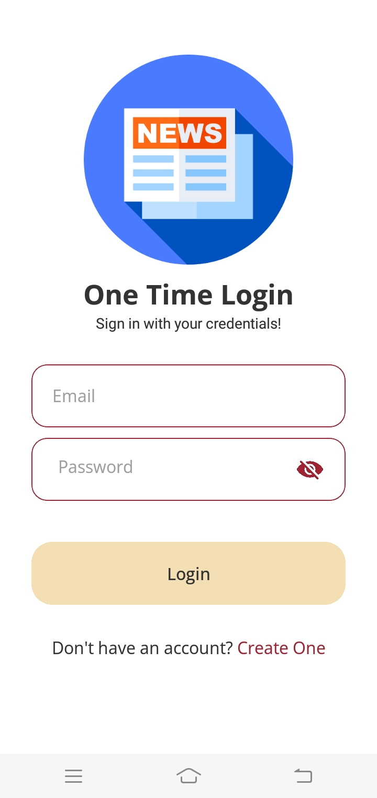
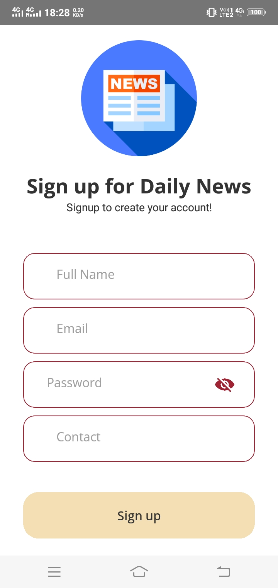
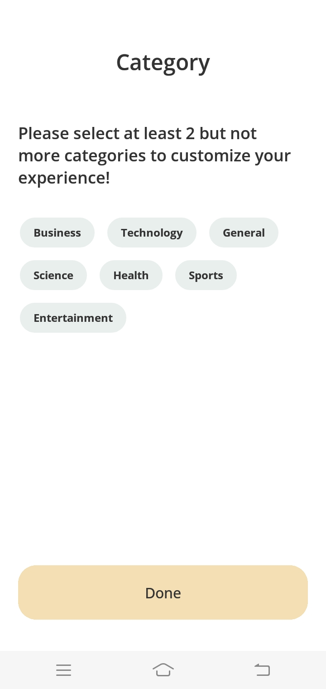

<h1 align="center">News App - Exploring Daily News Articles & Share to your Network!</h1>
<h5 align="center">Read Daily News in Summary & Headlines.</h5>

Read this doc from top to bottom for full feature details and usage for news app project.

<h3>Project Overview</h3>

This project is a simple news app that fetches news articles from a news API and displays them

To setup this project in your local dev environment follow the guide mentioned in README.md File

Don't forget to mention environment variables in your files .env files

If you need separate environment variables then scripts are already setup, you just need to create separate .env file for development, qa and production!

 
 
 

#### Features

- Fetching News Data from Newsapi.org (Alternative for Google API)
- Displaying News Data in Swiping Cards & Flatlist.
- Filtering News Data by Category.
- Searching News Data by Keyword.
- Displaying News Data in Detail Screen.
- Sharing News Data on Social Media.
- Saving User Preferences to Local Storage.
- Handling Network Errors using Fallback UI.
- Implementing Dark Mode (User can set Light & Dark Theme).
- Implementing Custom Fonts.
- Implementing Custom Colors.
- Implementing Custom Icons.
- Implementing Custom Animations.
- Implementing Custom Shadows.
- Implementing Custom Borders.
- Implementing Custom Text Styles.
- Implementing Custom Image Styles.
- Implementing Custom View Styles.
- Implementing Custom Button Styles.
- Implementing Custom TextInput Styles.
- Implementing Custom Switch Styles.
- Implementing Custom Slider Styles.
- Implementing Custom Navigations for Stack, Drawer & Tab using React Navigation.
- Implementing Audio Screen for user to listen Audio (using react-native-tts) (Text-To-Speech Lib)
- Implementing Full User Auth flow (Login, Signup, Logout) using Firebase.
- Storing user Reactions in Firebase.
- Implementing Firebase Firestore for storing user data.

#### App Flow Diagram

#### Navigation Flow

#### Application UI Screenshots

    
    <h5>Login Screen</h5>

    
    <h5>Signup Screen</h5>

    
    <h5>Category Screen</h5>

